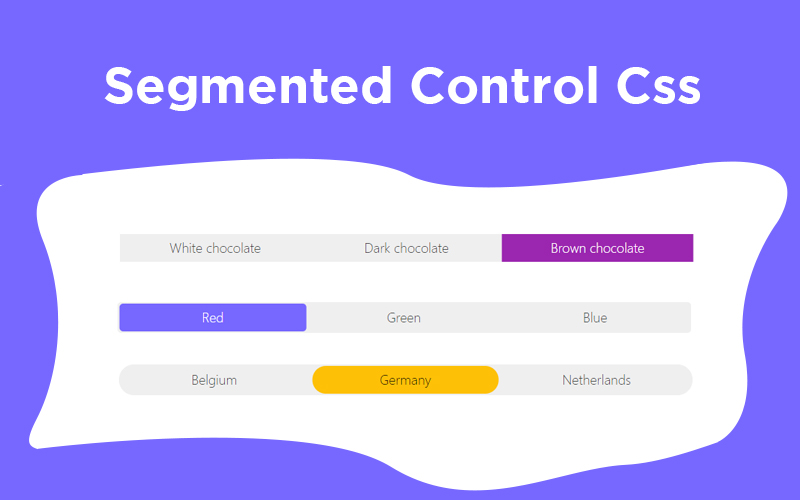

##### Segmented Control CSS allows you to create IOS style radio buttons. It is easy to use and no javascript is required. Less then 10 Ko and compatible with IE11!

## Table of Contents

- [Installation](#installation)
- [Get started](#get-started)
- [Support](#support)
- [Contributing](#contributing)
- [Author](#author)
- [License](#license)

## Documentation

[Complete documentation](https://basilebong.com/open-source/segmented-control-css)

## Installation

### Via npm or yarn

```html
npm i segmented-control-css
```

```
yarn add segmented-control-css
```

Then add the _segmented-control.min.css_ to your _head_. The file is located in the _dist_ folder.

```html
<link
  rel="stylesheet"
  href="[path-to-segmented-control-css]/dist/segmented-control.min.css"
/>
```

Note: There are also SCSS files available if you prefer to bundle it in your own CSS.

### Via CDN

Add this code to your _head_.

```html
<link
  rel="stylesheet"
  href="https://unpkg.com/segmented-control-css/dist/segmented-control.min.css"
/>
```

## Get started

⚠️ Each segmented-control-btn needs an input with an id and a label. The "for" attribute
of the label needs to be the same as the id of the input ⚠️

```html
<form>
  <div class="segmented-control">
    <div class="segmented-control-btn">
      <input type="radio" id="react" name="frameworkJs" value="react" checked />
      <label for="react">React</label>
    </div>
    <div class="segmented-control-btn">
      <input type="radio" id="angular" name="frameworkJs" value="angular" />
      <label for="angular">Angular</label>
    </div>
    <div class="segmented-control-btn">
      <input type="radio" id="vue" name="frameworkJs" value="vue" />
      <label for="vue">Vue</label>
    </div>
  </div>
</form>
```

[Complete documentation](https://basilebong.com/open-source/segmented-control-css)

## Support

Please open an issue for support.

## Contributing

Please contribute using [Github Flow](https://guides.github.com/introduction/flow/). Create a feature/branch, add commits, and open a pull request.

## Author

[Basile Bong](https://basilebong.com)

## License

[MIT](https://en.wikipedia.org/wiki/MIT_License)
